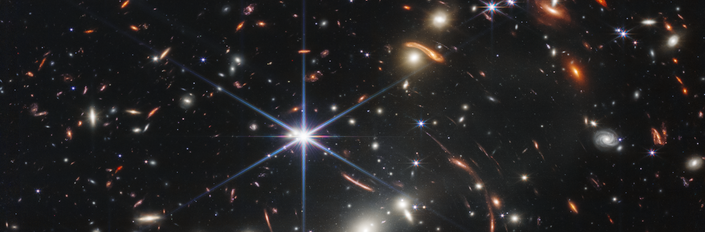

<!-- CSSを適用 -->
<link rel="stylesheet" href="{{'/css/style.css'|relative_url}}">

 Date  
Dec 18th, Wednesday, 2024
  

  Places  

Room 913 in Science Building 1 
Department of Physics, University of Tokyo
Access is [here](https://www.phys.s.u-tokyo.ac.jp/en/access/)
 
 

  Speakers  

- Dr. Mahsa Kohandel (Scuola Normale Superiore)
- Dr. Aswin Vijayan  (University of Sussex)
- Ms. Yurina Nakazato (The University of Tokyo)
  

## Program Schedule

| Time          | Session                                   | Speaker        |
|---------------|-------------------------------------------|----------------|
| 13:00 - 13:20 | Summary of z > 10 observations by ALMA and JWST | Yurina Nakazato |
| 13:20 - 13:45 | Bridging zoom-in cosmological simulations of early galaxies and multi-wavelength observations: SERRA view                        | Mahsa Kohandel  |
| 13:45 - 14:00 | Q and A                                  |                |
| 14:00 - 14:25 | Living in a broken Universe: Insights from FLARES for the high-z Universe                     | Aswin Vijayan   |
| 14:25 - 14:40 | Q and A                                  |                |
| 14:40 - 15:05 | Tracing Early Galaxy Formation with FirstLight: Statistical Insights and Inner Structures of high-z galaxies                | Yurina Nakazato |
| 15:05 - 15:20 | Q and A                                  |                |
| 15:20 - 15:30 | Coffee Break                             |                |
| 15:30 - 17:00 | Discussion                               |                |

 Abstract  
### Living in a broken Universe: Insights from FLARES for the high-z Universe  
#### Aswin Vijayan  
JWST with its unparalleled sensitivity, broad wavelength coverage, and exceptional spatial and spectral resolution, has revolutionized the study of galaxy formation. It has uncovered bright, star-forming galaxies at redshifts as high as 𝑧∼14, detected low-luminosity active galactic nuclei (AGN) at 𝑧>7, and revealed distant quiescent galaxies. These discoveries raise a critical question: to what extent do these observations challenge our current models of galaxy formation and evolution? While some initial claims have been proven to be erroneous, several compelling tensions with theoretical models persist, offering exciting opportunities for better understanding the high-z Universe. In this talk I will focus on what we have learnt from the First Light And Reionisation Epoch Simulations (FLARES) by confronting the model against the latest observations.  

### Bridging zoom-in cosmological simulations of early galaxies and multi-wavelength observations 
#### Mahsa Kohandel  
Over the past decade, spatially resolved observations from ALMA and JWST have revolutionised galaxy formation studies by enabling us to probe the structural properties of distant galaxies during the Epoch of Reionization, a pivotal era when the Universe underwent significant transformations. However, interpreting these observations remains challenging due to the extreme gas dynamics, intense radiation fields, and rapid assembly timescales characteristic of the early Universe.

To unravel the complexities of these systems, zoom-in cosmological simulations provide a powerful tool by accurately modelling both the detailed physics of the interstellar medium and the surrounding cosmological environment.

In this presentation, I will introduce the SERRA project, which has made substantial progress in bridging the gap between simulations and observations. I will discuss how SERRA reproduces galaxy properties for direct comparison with current and upcoming observational data. Specifically, I will touch upon results on emission lines, UV and continuum emission, as well as the modelling of integral-field-unit-like data cubes derived from these simulations.

### Tracing Early Galaxy Formation with FirstLight: Statistical Insights and Inner Structures of high-z galaxies  
#### Yurina Nakazato  
JWST has unveiled an unexpectedly large abundance of UV-bright galaxies at z > 10 with its high sensitivity and revealed diverse morphologies of z > 6 galaxies, such as clumpy and disk galaxies. Using the FirstLight zoom-in simulations, which provide mass-complete samples and high spatial and time resolutions, I will present insights into these recent observational findings. Additionally, I will share updates on my ongoing multi-wavelength analyses, exploring future synergies between JWST and ALMA.

